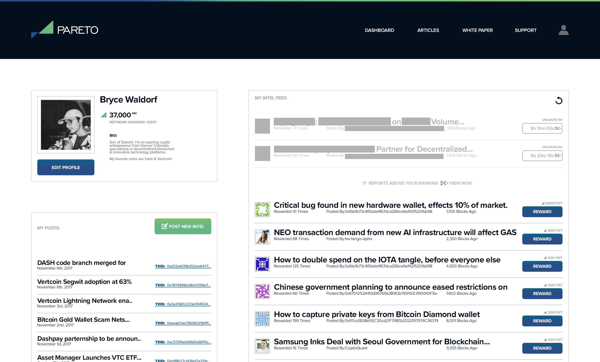
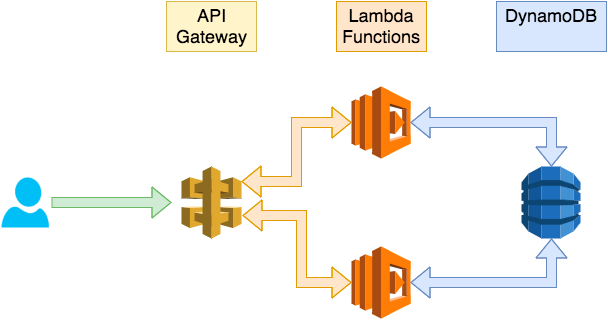

# Pareto Network MVP/Alpha

Current, reputable & actionable intel for digital currency traders and investors. 

The Pareto Network is a financial intel platform. Users gain access by signing an Ethereum address which contains Pareto tokens built using erc20 smart contract standard. This allows user identity, accounting and authentication to be offloaded to the Ethereum blockchain. The Pareto Network doesn't use more onchain and further maintains its distributed nature through an adhoc network of intel providers. Intel providers are compensated in Pareto tokens.

The present MVP/Alpha stores intel in a centralized database, further iterations may leverage distributed blob storage such as IPFS depending on the performance limitations of the solution.

The code here is only the Node.js built for the AWS Lambda functions. The majority of the Alpha involves the configurations on AWS between API Gateway, Lambda, S3, DynamoDB as well as the routing to those functions.

This method lays the ground work for a scalable solution which allows for additional integrations to be built making use of the API and infrastructure of Amazon.

