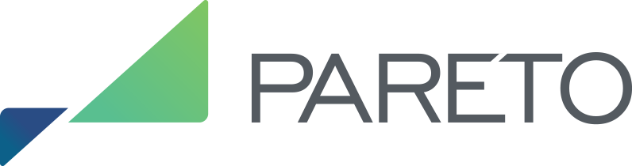
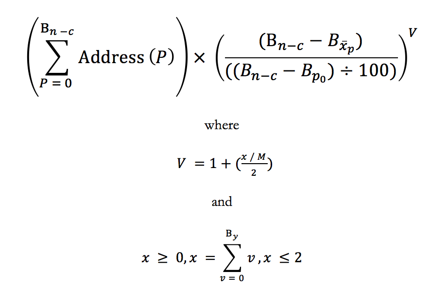

# Pareto Network MVP/Alpha

  

## Introduction

Current, reputable & actionable intel for digital currency traders and investors. 

The Pareto Network is a financial intel platform. The purpose is to change the incentive model around how profitable event-driven information is shared while giving its consumers confidence in the objective nature of the information. More information regarding the incentive and monetization model is described in the [White Paper](https://pareto.network/download/Pareto-Technical-White-Paper.pdf "Pareto Network White Paper") 
###### (White paper also available in [한국어](https://pareto.network/download/Pareto-Technical-White-Paper-kor.pdf "Pareto Network 한국어"), [日本語](https://pareto.network/download/Pareto-Technical-White-Paper-jpn.pdf "Pareto Network 日本語"), [简体中文](https://pareto.network/download/Pareto-Technical-White-Paper-zho-CN.pdf "Pareto Network 简体中文"), [中國傳統語言](https://pareto.network/download/Pareto-Technical-White-Paper-zho-TW.pdf "Pareto Network 中國傳統語言"))

Users gain access by signing an Ethereum address which contains Pareto tokens built using erc20 smart contract standard. This allows user identity, accounting and authentication to be offloaded to the Ethereum blockchain. The Pareto Network doesn't use more onchain and further maintains its distributed nature through an adhoc network of intel providers. Intel providers are compensated in Pareto tokens.

  

## Architecture

The present MVP/Alpha stores intel in a centralized database, further iterations may leverage distributed blob storage such as IPFS depending on the performance limitations of the solution.

The code here is only the Node.js built for the AWS Lambda functions. The majority of the Alpha involves the configurations on AWS between API Gateway, Lambda, S3, DynamoDB as well as the routing to those functions.

  

This method lays the ground work for a scalable solution which allows for additional integrations to be built making use of the API and infrastructure of Amazon.

## Access

The Pareto Network users are distinguished by a primary Ethereum address. The network checks to see if there is a balance of Pareto tokens in their address and grants the user access if they are able to sign the address. Signing proves ownership of the address. This can be accomplished through a manual process or automated process using browser extensions such as Metamask.

## Ranking

Rank in the Pareto Network determines how soon you are able to access financial intel.

Pareto users are subject to an ongoing Proof of Activity analysis to determine their ranking. The formula is described in the white paper and posted here for reference.

  

The Lambda functions here currently omit the implementations of the formula, and instead are placeholders to provide the glue for the system architecture, giving code for the API Gateway routes to execute and the DynamoDB methods to write to. Given the integral nature of the Pareto tokens to the Pareto system even though the contract had not been deployed on mainnet during testing, a different deployed contract signature is implemented for analysis and references to it may be seen in the code.
